<div align = "justify">

# **Irrigação do Jardim Vertical do Prédio A**

## __Descrição Técnica__
O objetivo do projeto é realizar a irrigação do Jardim Vertical do prédio A com períodos e durações de irrigação pré-estabelecidos, além de possuir acionamento remoto por uma API REST. Os dados de *status* da válvula solenoide serão enviados para a API da plataforma ThingSpeak.

## __Teoria__
### **Protocolo HTTP**
Protocolo de comunicação criado no começo da década de 90 por Tim Berners Lee. Ele permite a distribuição de quaisquer tipos de dados por meio da internet. 
<div align = "center">

</div>

Esse protocolo é unidirecional, com conexão intermitente e composto pelo cliente e pelo servidor. O cliente pode ser um navegador *web*, dispositivo móvel ou qualquer dispositivo conectado à internet. O servidor permite: 
- Armazenamento e o backup de dados;
- Compartilhamento de sistemas;
- Controle de usuários;
- Outros serviços. 

Basicamente, o HTTP é um protocolo de **requisição-resposta** que permite que o cliente **solicite** ou **requisite** (*request*) uma imagem, um vídeo ou qualquer outro tipo de dado por meio de uma URL, então o servidor recebe a URL e envia uma **resposta** (*response*) contendo o conteúdo especificado pelo cliente e/ou um **código** numérico que representa o *status* da **resposta** enviada. Toda essa comunicação é feita por meio do protocolo TCP/IP ou por meio de TLS (dado criptografado) permitindo o tráfego seguro dados, que unido ao HTTP é chamado de HTTPS.

Para definir o tipo de ação que o servidor tomará, o cliente utiliza comandos chamados **métodos** ou **verbos**. Os mais utilizados são:  
- **GET:** Cliente requisita dados para servidor.  
- **POST:** Cliente envia dados ao servidor. 

O protocolo HTTP é simples e extensível, e essas características o tornam muito utilizado em:
- Arquitetura e Desenvolvimento *Web*;
-  Aplicações IoT; 
- Sistemas Embarcados; 
- Repositórios; 
- Plataformas IoT; 
- Outras aplicações.

Existem outros protocolos comunicação baseados em HTTP, como o **REST**. Ele é mais flexível, leve, rápido e sem restrições para o formato de envio das mensagens, porém o desenvolvedor é responsável pela comunicação transparente do protocolo.

### **Solenoide**
Consiste em um eletroimã (dispositivo que converte energia elétrica em energia mecânica), ou seja, uma bobina de núcleo metálico e fios de cobre esmaltados enrolados em espiral.   
O seu princípio de funcionamento básico, é a geração de campo magnético quando há passagem de corrente elétrica pela solenoide. Esse campo magnético cria um movimento linear que permite acionar interruptores, válvulas ou ignição automotiva, automatizando esses e outros processos.
<div align = "center">

</div>

A principal vantagem em relação aos ímãs permanentes, é que os solenoides podem ser desligados com a ausência da corrente. São muito utilizados na área de: Eletrônica Geral, Automação, Sistema Embarcado Automotivo e Aeronaútico, entre outras aplicações. Em nosso projeto será utilizado uma solenoide que permitirá ou não a passagem de água de acordo com a programação do microcontrolador.

### **Capacitor**
Dispositivo eletrônico formado por dois terminais separados por um  material isolante elétrico, ele tem a função de armazenar cargas elétricas e fornecê-las ao circuito.  

<div align = "center">

</div>

São utilizados também para filtrar a corrente elétrica e evitar ruídos vindos de outros componentes, que no caso abaixo, é o ruído presente na Fonte AC/DC do circuito da caixa de passagem.


### **Relé**
Componente eletromecânico composto por uma solenoide e uma mola de rearme conectada à um contato e à dois terminais Normalmente Fechado (**NF**) e Normalmente Aberto (**NA**). O estado de repouso do relé é **NF**.  
Ao energizar o relé, aciona-se a solenoide, ela cria um campo eletromagnético, que por sua vez, atrai o contato e muda sua a posição para o terminal **NA**.  

<div align = "center">

</div> 

Principal vantagem é que devido ao isolamento da solenoide em relação aos contatos, não há mistura de sinais. Esse dispositivo é muito utilizado na área de: Automação, Elétrica, Eletrônica, IoT, entre outras. 

### **Transistor**
Dispositivo semicondutor feito de silício ou germânio que possui três terminais: **emissor**, **base** e **coletor**. Ele foi criado com o intuito de controlar uma corrente maior por meio de uma corrente com a intensidade menor na **base** do transistor, com isso, é possível amplificar ou atenuar a intensidade da corrente ou barrar sua passagem. Outra possibilidade é de funcionar como uma chave, impedindo ou permitindo a passagem de corrente elétrica, desligando ou ligando o transistor, isso também é chamado de **modo de operação**.  

<div align ='center'>

</div>

Para controlar a passagem de corrente elétrica, controla-se a passagem dos elétrons dentro do dispositivo. Com o objetivo de conduzir corrente e aumentar o sinal do transistor, realiza-se a **dopagem**, que é a susbstituição dos átomos de silício ou germânio por outros elementos químicos, isso facilita a passagem de corrente. Existem dois tipo de dopagem: **N** e **P**.  
Na dopagem **tipo N** os átomos adicionam mais elétrons à rede cristalina do transistor. Na dopagem **tipo P** os átomos adicionam menos elétrons à mesma rede criando lacunas, portanto, tendo maior carga positiva. O **modo de operação** dos transistores depende da sua configuração e da **polarização direta** ou **reversa**, isso afeta diretamente espessura da **barreira de potencial** ou **região de depleção**, que é uma barreira formada pela falta ou excesso de elétrons relacionada a força de atração entre eles de acordo com a diferença de potencial. Há três tipos de configurações:
- Transistor "sanduíche" ou diodo;
- Transistor de Bipolar de Junção (TBJ): **tipo** **PNP** e **NPN**;
- Transistor de Efeito de Campo (TEC).

<div align ='center'>

</div>

As suas principais aplicações são: 
- Circuitos integrados; 
- Aparelhos eletrônicos e eletrodomésticos; 
- Portas lógicas;
- Outras aplicações.

### **Diodo**
Dispositivo semicondutor que possui dois terminais ânodo (A) e o cátodo (K). Formado pela junção de dois cristais de germânio ou silício dopados  do **tipo P** e **N**, e além disso, permite a passagem de corrente por um único sentido. Para permitir a passagem de corrente, deve-se primeiramente  **polarizar diretamente** o circuito e depois ultrapassar a **tensão de ruptura** (0,7 V), para impedir a passagem de corrente deve-se **polarizar inversamente**.  
<div align = 'center'>
 
</div>

Devido à existência de vários tipos de diodo (LED e  Diodo Zener) e cada tipo exerce funções específicas, portanto, o diodo pode ter muitas aplicações, como:
- Pontes Retificadoras;
- Iluminação LED;
- Proteção de componentes; 
- Outras aplicações.

### **Microcontrolador**
Microcontrolador é um dispositivo eletrônico que une hardware e software em um Circuito Integrado (CI), basicamente é um microcomputador, ele possui: microprocessador ou CPU, entradas e saídas, porta serial, contadores, temporizadores, circuitos de memória (RAM, Flash e/ou PROM).   

<div align = 'center'>

</div>  

Para funcionar é necessário passar instruções (programar) por meio de Ambiente de Desenvolvimento Integrado (IDE) para que esses comandos sejam convertidos em uma linguagem binária e o microcontrolador entenda, dessa forma, é possível controlar os dispositivos periféricos e receber e/ou enviar dados para partes internas ou para dispositivos externos. O microcontrolador é utilizado em: 
- Produtos eletrônicos e eletrodomésticos;
- Dispositivos de automação; 
- Aplicações IoT;
- Sistemas Embarcados; 
- Sistema de ensino (Arduino); 
- Outros.

### **Fonte AC/DC**
A função desse dispositivo de alimentação é  transformar a tensão que sai da rede elétrica (110 V e 220 V) em uma tensão menor (+3,3V, +5V, +12V e -12V), e que possa ser utilizada por dispositivos eletroeletrônicos e eletrodomésticos, como: *notebook*, *smartphone*, computador, entre outros dispositivos. Tipos básicos são: **fonte linear** e **fonte chaveada**.  

<div align = 'center'>

</div>

Basicamente, na **Fonte Linear**, utiliza-se o transformador para auxiliar na diminuição da tensão alternada da rede elétrica, depois passa por uma série de circuitos que filtram, retificam e regulam a tensão utilizando diodos, capacitores e reguladores de tensão. Ao fim desse processo a tensão é contínua. Já na **Fonte Chaveada**, para que o tamanho dos capacitores e dos transformadores possa ser reduzido, a frequência da tensão da rede é aumentada, depois disso, é realizado o mesmo processo de redução e filtragem da tensão alternada utilizado na **Fonte Linear**.

<div align = 'center'>

</div>

### **Python 3 e Suas Bibliotecas**
[Python 3](https://docs.python.org/3/tutorial/index.html) é uma linguagem de programação [orientada a objetos](https://www.alura.com.br/artigos/poo-programacao-orientada-a-objetos), e utiliza identações para diferenciar seu contexto de execução. Neste projeto, ela foi utilizada para a criação de um script capaz de se inscrever em um tópico MQTT e persistir os dados do tópico em um banco de dados relacional. Neste projeto foram utilizadas algumas bibliotecas do Python3: [paho-mqtt](https://www.eclipse.org/paho/clients/python/docs/), [pymssql](https://pythonhosted.org/pymssql/), [time](https://docs.python.org/3/library/time.html), [datetime](https://docs.python.org/3/library/datetime.html).

### **PI System**
O PI System™ é uma infraestrutura empresarial aberta que conecta dados baseados em sensores, sistemas e pessoas. O resultado é: informações acionáveis e em tempo real que capacitam as empresas a otimizar e transformar seus negócios.

## __Materiais Utilizados__

- 1 NodeMCU ESP8266 v3
- 1 RTC DS1307
- 1 HLK-PM01 AC/DC 220v para 5V
- 6 Conectores Borne KRE 2 Vias
- 5 Resistores 220 ohms 
- 1 Capacitor 100nF
- 1 Diodos 1n4007
- 1 LED verde
- 1 LED vermelho
- 1 LED Azul
- 1 Chave on/off impermeável
- 1 Relé 1 Contato Reversível 5vdc 
- 1 Placa de Fibra de Vidro Virgem Cobreada 10x10 cm
- 1 Plug Conector Metálico Mike Gx16 Para Painel 2 Pinos
- 1 Caixa De Passagem Sobrepor Elétrica 10x15 
- 1 Barramento de pinos (macho)
- 1 Barramento de pinos (fêmea)
- 1 Válvula solenoide 127V 180° (¾ x ¾) VA 04
- 1 Transistor NPN BC547
- 1 Fio com plug de tomada macho
- 1 Porta fusivel
- 1 Fusivel 1A


## __Guia de Instalação__

Configuração da IDE do Arduino para o NodeMCU

Entrar na IDE do Arduino e clicar em Arquivo -> Preferências:  
<div align ='center'>
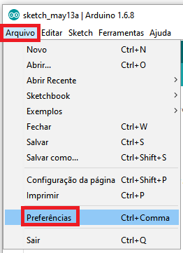
</div>

Na tela seguinte, copie o link do ESP8266 **http://arduino.esp8266.com/stable/package_esp8266com_index.json** e cole no campo **URLs adicionais de Gerenciadores de Placas**.

A sua tela ficará assim:  

<div align ='center'>  
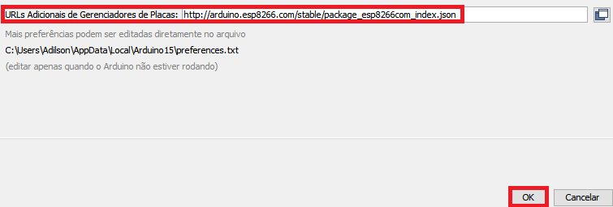
</div>

Clique em **OK** para retornar à tela principal da IDE.

Agora clique em **Ferramentas** -> **Placa** -> **Gerenciador de Placas**:  

<div align ='center'>  
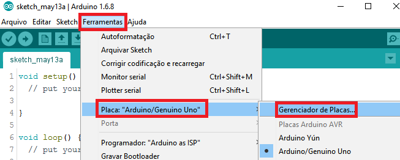
</div>

Digite ``esp8266``, utilize a barra de rolagem para encontrar o **esp8266 by ESP8266 Community** e clique em **Instalar**

<div align ='center'>  
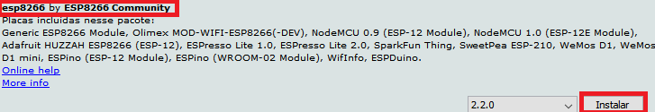
</div>

Após alguns minutos as placas da linha ESP8266 já estarão disponíveis na lista de placas da IDE do Arduino.

## __Guia de Montagem__

Os componentes devem ser montados da seguinte forma:  

<div align ='center'> 
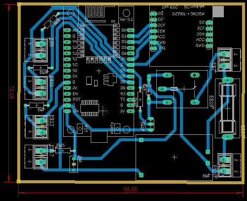
</div>

## __Guia de Implementação__

A válvula solenoide deve ser montada o mais profundo possível dentro da caixa de passagem, senão a tampa não fechará, além disso, deve ficar o mais próximo das extremidades da caixa de pssagem para que não atrapalhe a montagem da parte eletrônica.
No caso de vazamentos, para evitar possíveis danos na parte eletrônica da caixa de passagem, separou-se a parte que contém a válvula solenoide da parte eletrônica, criando-se uma divisória de acrílico e silicone, como mostra a imagem abaixo.
<div align ='center'> 
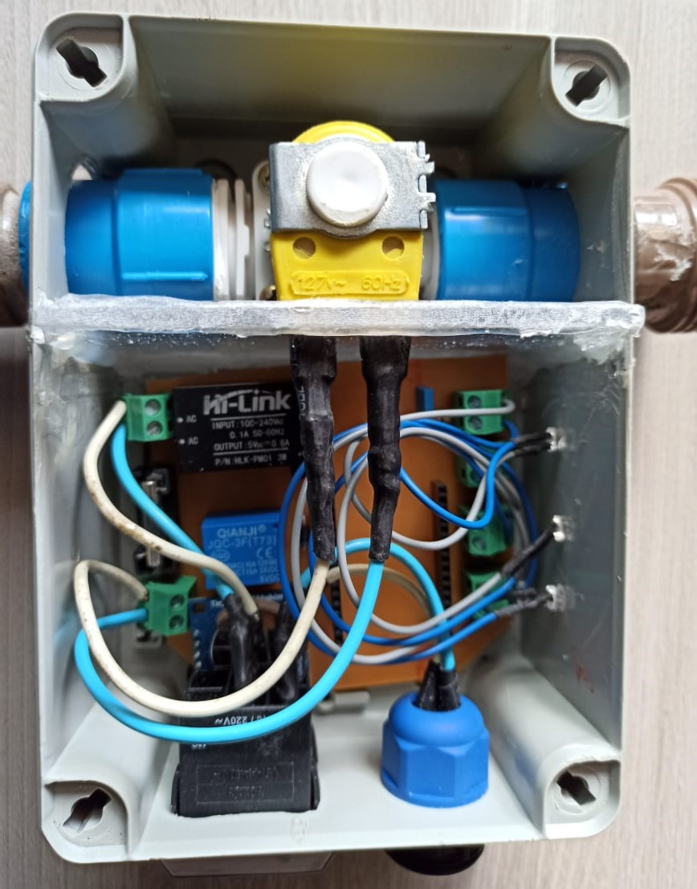
</div> 

Além disso, foi deixada uma abertura em torno do cano, na parte da válvula solenoide, para que haja o escoamento da água em caso de vazamento.   
<div align ='center'> 
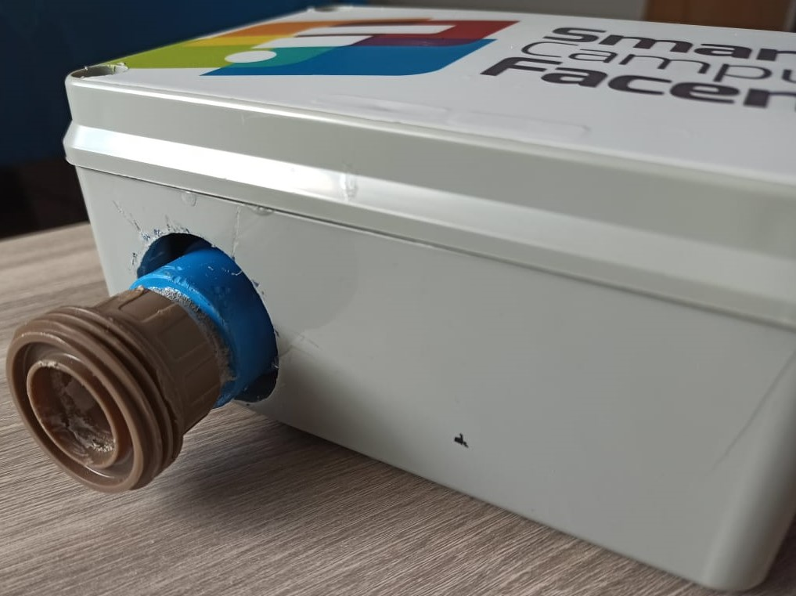
</div>

O botão ON/OFF e o *plug* de alimentação devem ficar suficientemente altos para que a placa que contém o circuito possa se acomodar em baixo deles, como mostram as imagens anteriores.  
<div align ='center'> 
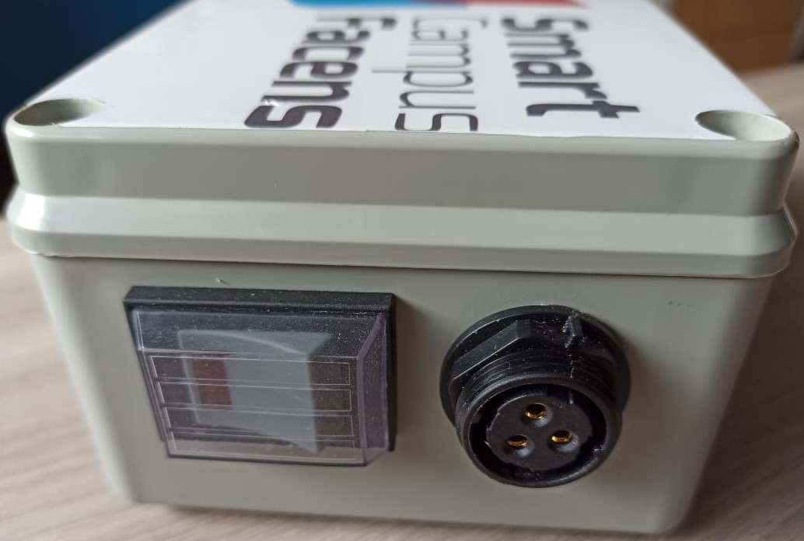
</div>

Para evitar que a água da irrigação ou a água de eventuais chuvas cheguem à parte eletrônica, a
parte superior da caixa de passagem deve ser completamente vedada. Na imagem a seguir, também foram vedados: 
- O cano de passagem da água;
- Os LEDs indicadores de:
    - Alimentação;
    - Envio de dados para API;
    - Acionamento da solenoide para irrigação.  

<div align ='center'> 
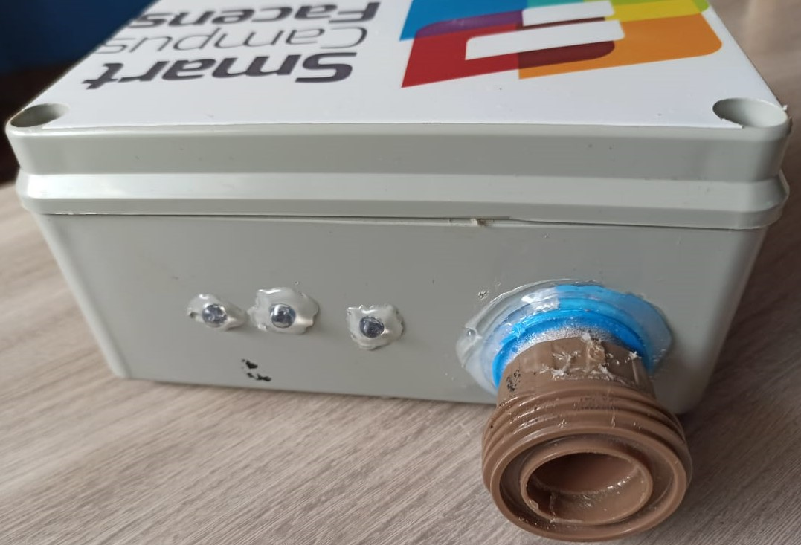
</div> 

No caso de haver necessidade de remoção da caixa de passagem, foram implementados registros para garantir a segurança do aparelho e a continuidade da irrigação de forma manual.    
<div align ='center'> 
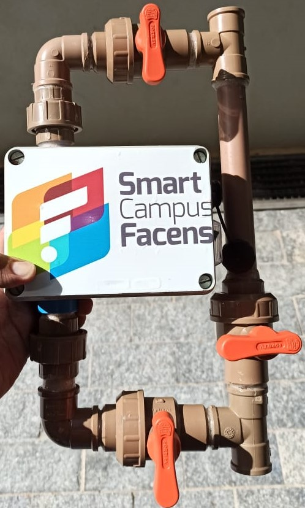
</div>

### **Banco de dados**

Foi criado uma tabela chamada **jd_Vertical_PredioA** no *database* **clima** com os seguintes atributos:
- **data** - data e hora que a mensagem foi enviada.
- **v1** - status da válvula de irrigação.

Estrutura da tabela:

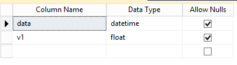

Dados apresentados na tabela:

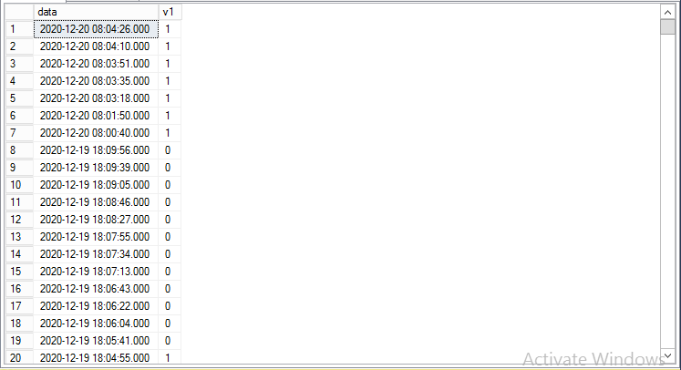

### **PI Data Archive**

Foram criadas 2 *tags* para armazenar as informações de cada atributo no *Data Archive*.

*Tags* criadas para armazenar informações do Jardim Vertical do Prédio A:

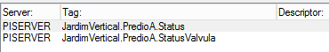

Tags com o modelo de consulta SQL:

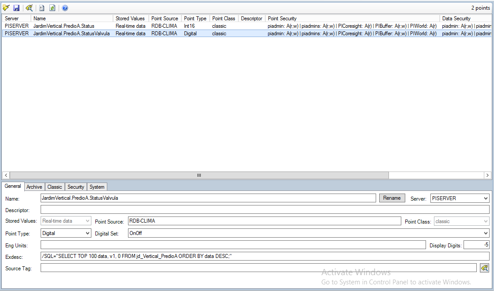

A tag **JardimVertical.PredioA.StatusValvula** consulta os dados no SQL Server, já a tag **JardimVertical.PredioA.Status** armazena dados vindos de análises do PI Server.

### **Jardim Vertical do Prédio A Template**
Foi criado um template para organizar os elementos. Foram adicionadas todas as tags com um caminho genérico **\\%Server%\%..\Element%.%Element%.%Attribute%**, que por sua vez busca a *tag* de acordo com o diretório gerado pelos nomes dos elementos.

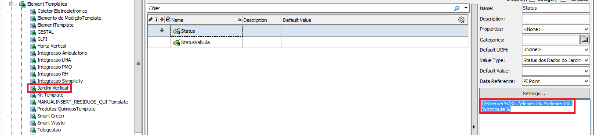

O template também contém análises para indicar se os dados estão atualizados e disparar emails caso não esteja.

Análise do status da válvula
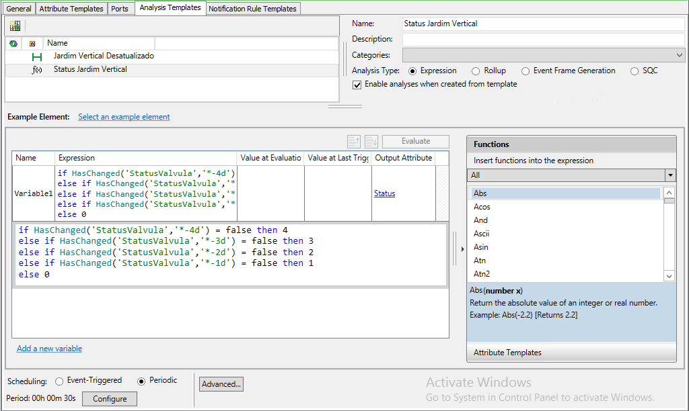

Análise para envio de email
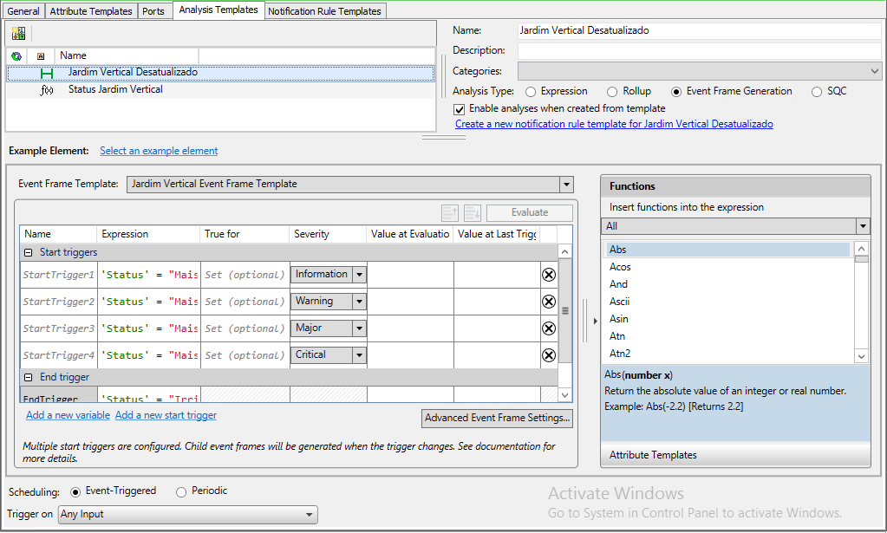

### **Jardim Vertical do Prédio A Enumeration Sets**
Foram utilizados *enumeration sets* para transformar os números inteiros vindo das análises em frases para a melhor clareza das informações.
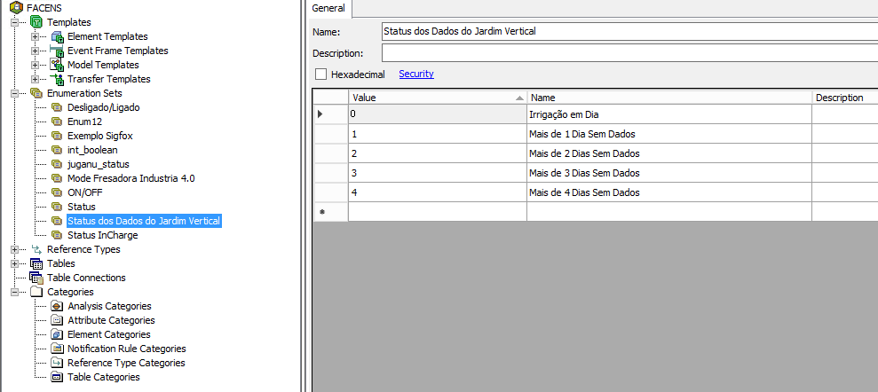

### **Elements**
A árvore de elementos foi criada de forma a trabalhar em conjunto com o template formando o caminho das *tags*.

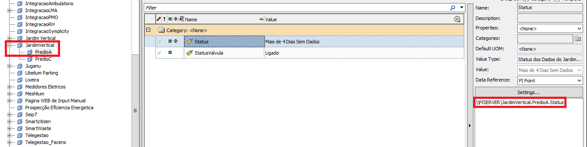

### **Script usando Python3**

Foi criado um [*script*](https://gitlab.com/smart-campus-facens/irrigacao-jardim-vertical-predio-a/-/blob/master/Jardim%20Vertical%20Predio%20A%20-%20Scripts/Pegar%20Dados%20da%20API%20e%20Por%20no%20BD/apiJARDIMVERTICAL_Predio_A.py) em *python* o qual realiza *requests* na API *Rest* do Thingspeak e salva suas mensagens na tabela do banco de dados criada acima.

### **Servidor**

Ubuntu 16.04.7 LTS

O [*script*](https://gitlab.com/smart-campus-facens/irrigacao-jardim-vertical-predio-a/-/blob/master/Jardim%20Vertical%20Predio%20A%20-%20Scripts/Pegar%20Dados%20da%20API%20e%20Por%20no%20BD/apiJARDIMVERTICAL_Predio_A.py) criado está no seguinte caminho do servidor:

/srv/jobs/smartcontrol/jardimvertical

Foi criado um arquivo .sh para que o [*script*](https://gitlab.com/smart-campus-facens/irrigacao-jardim-vertical-predio-a/-/blob/master/Jardim%20Vertical%20Predio%20A%20-%20Scripts/Pegar%20Dados%20da%20API%20e%20Por%20no%20BD/apiJARDIMVERTICAL_Predio_A.py) fosse executado no *crontab*. O conteúdo do arquivo é o seguinte:

```
#!/bin/bash

cd /srv/jobs/smartcontrol/jardimvertical

python3 apiJARDIMVERTICAL_Predio_A.py

cd -

```

Em /etc/crontab foi aicionado o caminho do arquivo .sh criado acima com seu respectivo período de execução.

Imagem do crontab:

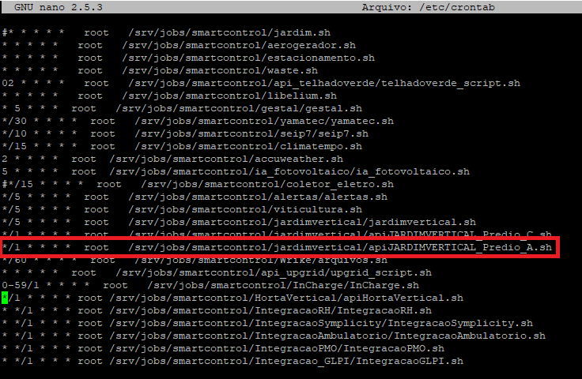

## __Visualização criada no projeto__

 

## __Resultados Esperados__
O equipamento deve realizar a irrigação nos horários programados e durante esse período deve enviar seu *status* para os canais de recebimento de dados da API (*endpoints*). Além disso, o equipamento deve responder aos acionamentos remotos enviados pela API.

## __Pontos de Atenção__
 
Para evitar que a irrigação continue acionada o tempo todo, atente-se para que o acionamento remoto via API não fique acionado.

Para que tudo se encaixe perfeitamente, atente-se aos processos de montagem ditos anteriormente no **Guia de Implementação**, pois não há folgas para a montagem dentro do espaço da caixa de passagem.

## __Referências__
**Sites**:  
[Alura](https://www.alura.com.br/artigos/qual-e-diferenca-entre-http-e-https "HTTP")  
[Athos Eletronics](https://athoselectronics.com/rele/ "Relé")   
[Athos Eletronics](https://athoselectronics.com/diodo/ "Diodo")  
[Brasil Escola](https://brasilescola.uol.com.br/fisica/transistor.htm "Transistor e Diodo")  
[Brasil Escola](https://brasilescola.uol.com.br/fisica/capacitores.htm "Capacitor")  
[Clube do Hardware](https://www.clubedohardware.com.br/artigos/energia/tudo-o-que-voc%C3%AA-precisa-saber-sobre-fontes-de-alimenta%C3%A7%C3%A3o-r34441/ "Fonte AC/DC")  
[Detto](https://detto.com.br/para-que-serve-um-servidor/ "HTTP")  
[Developer Mozilla](https://developer.mozilla.org/pt-BR/docs/Web/HTTP/Overview "HTTP")  
[Eletron Jun](https://www.eletronjun.com.br/post/o-que-s%C3%A3o-microcontroladores-descubra-suas-aplica%C3%A7%C3%B5es "Microcontrolador")  
[Ilumisul](http://www.ilumisul.com.br/como-funciona-um-solenoide/ "Solenoide")  
[Medium](https://medium.com/@renancprata/mqtt-vs-rest-perspectiva-de-uma-implementa%C3%A7%C3%A3o-iot-4c7e1f26689c#:~:text=A%20arquitetura%20MQTT%20permite%20que,instantaneamente%2C%20conforme%20esperado%20pelos%20clientes. "HTTP")  
[Mundo da Elétrica](https://www.mundodaeletrica.com.br/o-que-e-rele-como-funciona-um-rele/ "Relé")  
[Stack Overflow](console.thinger.io/#!/console/devices "REST e HTTP")  
[Treina Web](https://www.treinaweb.com.br/blog/o-que-e-http-request-get-post-response-200-404/ "HTTP")  
[Wikipédia](https://pt.wikipedia.org/wiki/Hypertext_Transfer_Protocol "HTTP")  
[Wikipédia](https://pt.wikipedia.org/wiki/Microcontrolador "Microcontrolador")  

**Canais:**  
[WR Kits](https://www.youtube.com/watch?v=jt1gBC2Bo7g "Transistor")

</div>
